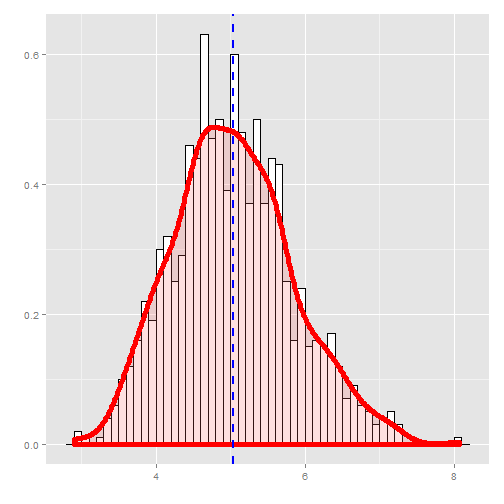
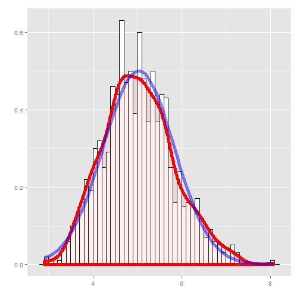

# The exponential distribution and the Central Limit Theorem
Yaroslav Yermilov

## Overview

In this report we will investigate the exponential distribution and compare it with the Central Limit Theorem. We will investigate the distribution of averages of 40 exponentials in 1000 simulations.

As part of analysys we will:

1. Show the sample mean and compare it to the theoretical mean of the distribution.

1. Show how variable the sample is (via variance) and compare it to the theoretical variance of the distribution.

1. Show that the distribution is approximately normal.


## Simulations

To simulate the exponential distribution R function rexp is used. It's rate is set to 0.2, which means that it's theoretical mean is 1/0.2 = 5 and theoretical standard deviation is also 5. 
We will investigate averages of 40 iid, simulated 1000 times:


```r
number_of_simulations <- 1000
sample_size <- 40
lambda <- 0.2

exp_means <- NULL
for (i in 1:number_of_simulations) exp_means = c(exp_means, mean(rexp(sample_size, rate = lambda)))
head(exp_means)
```

```
## [1] 5.364266 3.738962 5.443620 4.189726 4.970103 3.382012
```

Let's look at distribution histogram:


```r
library(ggplot2)

data_frame <- data.frame(exp_means)

ggplot(data_frame, aes(x = exp_means)) + 
geom_histogram(aes(y = ..density..), binwidth=.1, colour="black", fill="white") + 
geom_density(size = 2, color = "red", alpha=.2, fill="#FF6666") + 
labs(x = '') + labs(y = '')
```

 

## Sample Mean versus Theoretical Mean

Theoretical mean of the distribution:


```r
theoretical_mean <- 1 / lambda
theoretical_mean
```

```
## [1] 5
```

Sample mean of the distribution:

```r
sample_mean <- mean(exp_means)
sample_mean
```

```
## [1] 5.032364
```

As we can see, they are almost equal:


```r
abs(theoretical_mean - sample_mean)
```

```
## [1] 0.03236355
```

Let's look at sample mean on distribution histogram:


```r
ggplot(data_frame, aes(x = exp_means)) + 
geom_histogram(aes(y = ..density..), binwidth=.1, colour="black", fill="white") + 
geom_density(size = 2, color = "red", alpha=.2, fill="#FF6666") + 
geom_vline(aes(xintercept = sample_mean), color = "blue", linetype = "dashed", size = 1) +
labs(x = '') + labs(y = '')
```

 

## Sample Variance versus Theoretical Variance

Theoretical variance of the distribution:

```r
theoretical_variance <- (1 / lambda^2) / sample_size
theoretical_variance
```

```
## [1] 0.625
```

Sample variance of the distribution:

```r
sample_variance <- sd(exp_means)^2
sample_variance
```

```
## [1] 0.6370447
```

As we can see, they are almost equal:


```r
abs(theoretical_variance - sample_variance)
```

```
## [1] 0.01204474
```

## Distribution

Let's finally compare our distribution with normal one:


```r
ggplot(data_frame, aes(x = exp_means)) + 
geom_histogram(aes(y = ..density..), binwidth=.1, colour="black", fill="white") + 
geom_density(size = 2, color = "red", alpha=.1, fill="#FF6666") + 
stat_function(fun = dnorm, args = list(mean = sample_mean, sd = sqrt(sample_variance)), size = 2, color = "blue", alpha=.5, fill="#FF6666") +
labs(x = '') + labs(y = '')
```

 

As we can see, our distribution is approximately normal.
