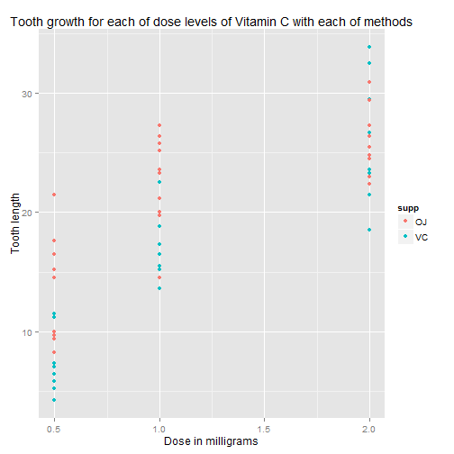
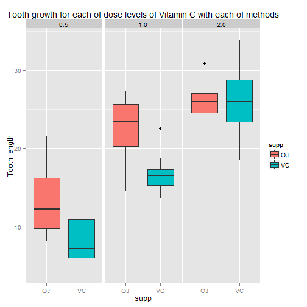

# Basic inferential analysis of tooth growth data

## Synopsis

We will perform basic inferential analysis for the length of teeth in each of 10 guinea pigs at each of three dose levels of Vitamin C (0.5, 1, and 2 mg) with each of two delivery methods (orange juice or ascorbic acid).

## Data Load

Let's load data:


```r
library(datasets)
data(ToothGrowth)
head(ToothGrowth)
```

```
##    len supp dose
## 1  4.2   VC  0.5
## 2 11.5   VC  0.5
## 3  7.3   VC  0.5
## 4  5.8   VC  0.5
## 5  6.4   VC  0.5
## 6 10.0   VC  0.5
```

## Exploratory analysys

Data size:


```r
dim(ToothGrowth)
```

```
## [1] 60  3
```

Summary of the data:


```r
summary(ToothGrowth)
```

```
##       len        supp         dose      
##  Min.   : 4.20   OJ:30   Min.   :0.500  
##  1st Qu.:13.07   VC:30   1st Qu.:0.500  
##  Median :19.25           Median :1.000  
##  Mean   :18.81           Mean   :1.167  
##  3rd Qu.:25.27           3rd Qu.:2.000  
##  Max.   :33.90           Max.   :2.000
```

Some exploratory plots:


```r
library(ggplot2)
ggplot(aes(x = dose, y = len), data = ToothGrowth) + 
geom_point(aes(color = supp)) +
labs(x = 'Dose in milligrams') +
labs(y = 'Tooth length') +
labs(title = 'Tooth growth for each of dose levels of Vitamin C with each of methods')
```

 


```r
ggplot(aes(x = supp, y = len), data = ToothGrowth) +
geom_boxplot(aes(fill = supp)) + 
facet_wrap(~ dose) +
labs(y = 'Tooth length') +
labs(title = 'Tooth growth for each of dose levels of Vitamin C with each of methods')
```

 

## Confidence Intervals and Hypothesis Testing

Data is neither paired nor with equal variance. 

Let's perform hypothesis testing for different circumstances:

### Dosage only

Firsly let's split data for paired comparison of dose levels (we will compare only nearest pairs):


```r
ToothGrowth_05vs10 <- subset(ToothGrowth, dose %in% c(0.5, 1.0))
ToothGrowth_10vs20 <- subset(ToothGrowth, dose %in% c(1.0, 2.0))
```


```r
t.test(len ~ dose, paired = FALSE, var.equal = FALSE, data = ToothGrowth_05vs10)
```

```
## 
## 	Welch Two Sample t-test
## 
## data:  len by dose
## t = -6.4766, df = 37.986, p-value = 1.268e-07
## alternative hypothesis: true difference in means is not equal to 0
## 95 percent confidence interval:
##  -11.983781  -6.276219
## sample estimates:
## mean in group 0.5   mean in group 1 
##            10.605            19.735
```


```r
t.test(len ~ dose, paired = FALSE, var.equal = FALSE, data = ToothGrowth_10vs20)
```

```
## 
## 	Welch Two Sample t-test
## 
## data:  len by dose
## t = -4.9005, df = 37.101, p-value = 1.906e-05
## alternative hypothesis: true difference in means is not equal to 0
## 95 percent confidence interval:
##  -8.996481 -3.733519
## sample estimates:
## mean in group 1 mean in group 2 
##          19.735          26.100
```

Both tests brings the same conclusion: bigger dose increases tooth growth.

### Supplement type for different doses

Let's now test supplement types for different doses:


```r
ToothGrowth_05 <- subset(ToothGrowth, dose == 0.5)
ToothGrowth_10 <- subset(ToothGrowth, dose == 1.0)
ToothGrowth_20 <- subset(ToothGrowth, dose == 2.0)
```


```r
t.test(len ~ supp, paired = FALSE, var.equal = FALSE, data = ToothGrowth_05)
```

```
## 
## 	Welch Two Sample t-test
## 
## data:  len by supp
## t = 3.1697, df = 14.969, p-value = 0.006359
## alternative hypothesis: true difference in means is not equal to 0
## 95 percent confidence interval:
##  1.719057 8.780943
## sample estimates:
## mean in group OJ mean in group VC 
##            13.23             7.98
```

Conclusion: for 0.5mg of Vitamin C, orange juice is better than ascorbic acid for tooth growth.


```r
t.test(len ~ supp, paired = FALSE, var.equal = FALSE, data = ToothGrowth_10)
```

```
## 
## 	Welch Two Sample t-test
## 
## data:  len by supp
## t = 4.0328, df = 15.358, p-value = 0.001038
## alternative hypothesis: true difference in means is not equal to 0
## 95 percent confidence interval:
##  2.802148 9.057852
## sample estimates:
## mean in group OJ mean in group VC 
##            22.70            16.77
```

Conclusion: for 1mg of Vitamin C, orange juice is better than ascorbic acid for tooth growth.


```r
t.test(len ~ supp, paired = FALSE, var.equal = FALSE, data = ToothGrowth_20)
```

```
## 
## 	Welch Two Sample t-test
## 
## data:  len by supp
## t = -0.0461, df = 14.04, p-value = 0.9639
## alternative hypothesis: true difference in means is not equal to 0
## 95 percent confidence interval:
##  -3.79807  3.63807
## sample estimates:
## mean in group OJ mean in group VC 
##            26.06            26.14
```

Conclusion: for 2mg of Vitamin C, there is no difference between orange juice or ascorbic acid.

## Conclusions

To sum up gotten conclusions:

* Bigger dose increases tooth growth.
* For 0.5mg and 1mg of Vitamin C, orange juice is better than ascorbic acid for tooth growth.
* For 2mg of Vitamin C, there is no difference between orange juice or ascorbic acid.
